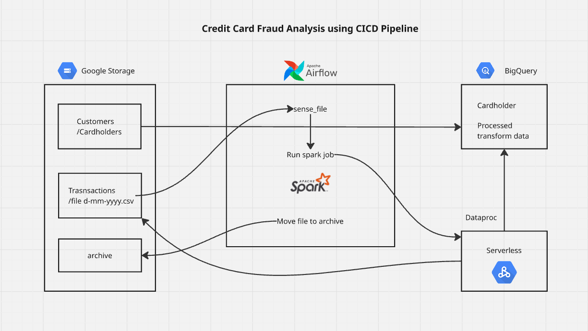

# Credit-Card-Fraud-Data-Analysis-using-CI-CD-Pipeline

### 📊 Architecture Diagram

## 📌 Project Overview

I built an **end-to-end Credit Card Fraud Detection Pipeline** on **Google Cloud Platform (GCP)** that can process **1M+ daily transactions** efficiently.  
The pipeline ingests raw **customer** and **transaction data**, cleans and transforms it using **Apache Spark**, applies fraud detection logic, and loads the processed data into **BigQuery** for analysis.  
Using **Airflow** for orchestration and **CI/CD (GitHub Actions)** for deployment reduced manual intervention by **80%**.

---

## 👤 My Role & Contributions

I was responsible for **designing and implementing the entire pipeline**, including:

- 🔹 Setting up data ingestion from **Google Cloud Storage**  
- 🧠 Writing **PySpark** jobs for data cleaning, transformation, and feature engineering  
- ⚡ Implementing **fraud detection logic** (e.g., high-risk transactions, fraud flags, reward points)  
- 🪄 Automating workflows using **Apache Airflow** and **CI/CD with GitHub Actions**  
- 🗂 Archiving raw files and loading processed data into **BigQuery** for downstream analysis

---

## 🧰 Tech Stack

| Tool / Service            | Purpose                                               |
|---------------------------|-------------------------------------------------------|
| **PySpark**               | Distributed data cleaning, transformation, feature engineering |
| **Apache Airflow**        | Task scheduling & orchestration                        |
| **BigQuery**             | Serverless data warehouse for analytics               |
| **Google Cloud Storage** | Raw data ingestion & archiving                        |
| **GCP Dataproc / Cloud Run** | Scalable serverless data processing              |
| **GitHub Actions (CI/CD)**| Automated pipeline deployment                         |

---

## 🧱 Workflow / Architecture

1. **Data Ingestion**  
   - Raw customer and transaction files are stored in **Google Storage**.

2. **Orchestration (Airflow)**  
   - Airflow monitors for new incoming files (`sense_file`) and triggers the Spark job.

3. **Processing with Spark (Dataproc)**  
   - Joins customer and transaction data  
   - Cleans and transforms records (valid IDs, positive transaction amounts, valid categories)  
   - Generates derived features (fraud risk score, reward points, fraud flags)

4. **Serverless Processing**  
   - Optional extra transformations using **Dataproc** or **Cloud Run**.

5. **Archiving**  
   - Raw files are moved to an `archive/` bucket for record-keeping.

6. **Storage & Analysis**  
   - Transformed data is stored in **BigQuery** (structured by cardholders) for downstream fraud analytics.

---

## 🚀 CI/CD Automation

- **GitHub Actions** is used for deploying Airflow DAGs and Spark jobs automatically.  
- This reduced manual deployment steps by **~80%**, ensuring **consistent, repeatable, and fast** updates to the pipeline.

---

## ⚔️ Challenges & Solutions

| Challenge | Solution |
|----------|----------|
| ⚡ **Handling 1M+ daily transactions** | Used **PySpark** for distributed processing and GCP’s **serverless scaling** |
| 🤖 **Automating pipeline** | Integrated **Airflow** for orchestration and **GitHub Actions** for CI/CD |
| 🧼 **Ensuring data quality** | Added strict validations (non-null IDs, positive amounts, transaction status) and engineered fraud detection features |

---

## 📈 Key Outcomes

- ✅ **Automated ingestion → transformation → analysis pipeline**  
- 🚀 **Scalable processing** of 1M+ transactions/day  
- 💡 **Fraud risk scores & feature engineering** integrated into pipeline  
- 🧰 **Modern CI/CD and orchestration** practices applied on GCP
